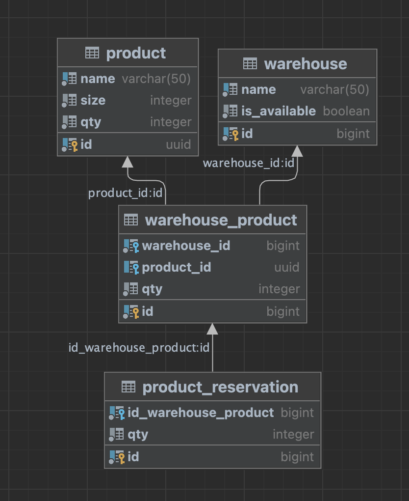

# WAREHOUSE_API

## Инструкция

1. Склонировать репозиторий
```
git clone https://github.com/vladjong/warehouse_api.git
```

2. Добавить `.env` файл в проект

3. Запустить проекта через docker compose
```
make docker
```
4. Запросы к api
- [Добавить товары из файла](#добавить-товары-из-файла)
- [Добавить склады из файла](#добавить-склады-из-файла)
- [добавить товары на определенный склад из файла](#добавить-товары-на-определенный-склад-из-файла)
- [Зарезервировать товар на складе](#зарезервировать-товар-на-складе)
- [Овобождение резерва товаров на складаx](#освобождение-резерва-товаров-на-складах)
- [Получение количествао оставшихся товаров на складе](#получение-количества-оставшихся-товаров-на-складе)
5. Завершить проект
```
make clean
```
6. Запустить тесты
```
make test
```

## Диаграмма БД



Тригер: 
`check_update_product` - удаляет каскадно данные из таблиц, когда товар полностью отправлен

Индексы:
- `product_id_in_warehouse_product` - на внешний ключ `product_id`
- `warehouse_id_in_warehouse_product` - на внешний ключ `warehouse_id`
- `warehouse_product_in_product_reservation` - на внешний ключ `id_warehouse_product`


## Методы API

### `http://0.0.0.0:8080/warehouse`

### Добавить товары из файла

<details>
<summary>структура запроса:</summary>

```go
type FilenameArgs struct {
	Filename string `json:"filename"`
}
```
</details>

<details>
<summary>метод:</summary>

```
warehouse.AddProductsInFile
```
</details>

<details>
<summary>пример запроса:</summary>

```
curl --location 'http://0.0.0.0:8080/warehouse' \
--header 'Content-Type: application/json' \
--data '{
    "jsonrpc": "2.0",
    "id": 1,
    "method": "warehouse.AddProductsInFile",
    "params": [
        {
        "filename": "data/product.csv"
        }
    ]
}'
```
</details>

<details>
<summary>пример ответа:</summary>

```json
{
    "result": {
        "status": "Successfully added"
    },
    "error": null,
    "id": 1
}
```
</details>

### Добавить товары

<details>
<summary>структура запроса:</summary>

```go
type ProductArgs struct {
	Products []entity.Product `json:"products"`
}

type Product struct {
	Id   string `json:"id" db:"id" csv:"id"`
	Name string `json:"name" db:"name" csv:"name"`
	Size int    `json:"size" db:"size" csv:"size"`
	QTY  int    `json:"qty" db:"qty" csv:"qty"`
}
```
</details>

<details>
<summary>метод:</summary>

```
warehouse.AddProduct
```
</details>

<details>
<summary>пример запроса:</summary>

```
curl --location 'http://localhost:8080/warehouse' \
--header 'Content-Type: application/json' \
--data '{
    "jsonrpc": "2.0",
    "id": 1,
    "method": "warehouse.AddProduct",
    "params": [
        {
        "products": [
            {
                "id": "476b5442-ee8b-4fbb-bfb9-689ae098a03b",
                "name":"test_1",
                "size": 120,
                "qty": 12
            },
            {
                "id": "07e4208a-1a96-4276-9522-489afcf20dab",
                "name":"test_2",
                "size": 120,
                "qty": 15
            }
        ]
    }
    ]
}'
```
</details>

<details>
<summary>пример ответа:</summary>

```json
{
    "result": {
        "status": "Successfully added"
    },
    "error": null,
    "id": 1
}
```
</details>

### Добавить склады из файла

<details>
<summary>структура запроса:</summary>

```go
type FilenameArgs struct {
	Filename string `json:"filename"`
}
```
</details>

<details>
<summary>метод:</summary>

```
warehouse.AddWarehousesInFile
```
</details>

<details>
<summary>пример запроса:</summary>

```
curl --location 'http://0.0.0.0:8080/warehouse' \
--header 'Content-Type: application/json' \
--data '{
    "jsonrpc": "2.0",
    "id": 1,
    "method": "warehouse.AddWarehousesInFile",
    "params": [
        {
        "filename": "data/warehouse.csv"
        }
    ]
}'
```
</details>

<details>
<summary>пример ответа:</summary>

```json
{
    "result": {
        "status": "Successfully added"
    },
    "error": null,
    "id": 1
}
```
</details>

### Добавить склады

<details>
<summary>структура запроса:</summary>

```go
type WarehouseArgs struct {
	Warehouse []entity.Warehouse `json:"warehouses"`
}

type Warehouse struct {
	Id         int64  `json:"id" db:"id" goqu:"skipinsert" csv:"id"`
	Name       string `json:"name" db:"name" csv:"name"`
	IsAvalible bool   `json:"is_avalible" db:"is_available" csv:"is_avalible"`
}
```
</details>

<details>
<summary>метод:</summary>

```
warehouse.AddWarehouses
```
</details>

<details>
<summary>пример запроса:</summary>

```
curl --location 'http://localhost:8080/warehouse' \
--header 'Content-Type: application/json' \
--data '{
    "jsonrpc": "2.0",
    "id": 2,
    "method": "warehouse.AddWarehouses",
    "params": [
        {
        "warehouses": [
            {
                "name":"test_1_w",
                "is_avalible": true
            },
            {
                "name":"test_2_2",
                "is_avalible": false
            }
        ]
    }
    ]
}'
```
</details>

<details>
<summary>пример ответа:</summary>

```json
{
    "result": {
        "status": "Successfully added"
    },
    "error": null,
    "id": 2
}
```
</details>

### Добавить товары на определенный склад из файла

<details>
<summary>структура запроса:</summary>

```go
type FilenameArgs struct {
	Filename string `json:"filename"`
}
```
</details>

<details>
<summary>метод:</summary>

```
warehouse.AddProductInWarehouseInFile
```
</details>

<details>
<summary>пример запроса:</summary>

```
curl --location 'http://0.0.0.0:8080/warehouse' \
--header 'Content-Type: application/json' \
--data '{
    "jsonrpc": "2.0",
    "id": 1,
    "method": "warehouse.AddProductInWarehouseInFile",
    "params": [
        {
        "filename": "data/product_in_warehouse.csv"
        }
    ]
}'
```
</details>

<details>
<summary>пример ответа:</summary>

```json
{
    "result": {
        "status": "Successfully added"
    },
    "error": null,
    "id": 1
}
```
</details>

### Добавить товары на определенный склад

<details>
<summary>структура запроса:</summary>

```go
type ProductInWarehouseArgs struct {
	ProductInWarehouse []entity.ProductInWarehouse `json:"products_in_warehouses"`
}

type ProductInWarehouse struct {
	Id          int64  `json:"-" db:"id" goqu:"skipinsert" csv:"id"`
	ProductId   string `json:"product_id" db:"product_id" csv:"product_id"`
	WarehouseId int64  `json:"warehouse_id" db:"warehouse_id" csv:"warehouse_id"`
	QTY         int    `json:"qty" db:"qty" csv:"qty"`
}
```
</details>

<details>
<summary>метод:</summary>

```
warehouse.AddProductInWarehouse
```
</details>

<details>
<summary>пример запроса:</summary>

```
curl --location 'http://localhost:8080/warehouse' \
--header 'Content-Type: application/json' \
--data '{
    "jsonrpc": "2.0",
    "id": 3,
    "method": "warehouse.AddProductInWarehouse",
    "params": [
        {
        "products_in_warehouses": [
            {
                "product_id": "476b5442-ee8b-4fbb-bfb9-689ae098a03b",
                "warehouse_id": 1,
                "qty": 3
            },
            {
                "product_id":"07e4208a-1a96-4276-9522-489afcf20dab",
                "warehouse_id": 2,
                "qty": 4
            }
        ]
    }
    ]
}'
```
</details>

<details>
<summary>пример ответа:</summary>

```json
{
    "result": {
        "status": "Successfully added"
    },
    "error": null,
    "id": 3
}
```
</details>

### Зарезервировать товар на складе

<details>
<summary>структура запроса:</summary>

```go
type ProductWarehouseArgs struct {
	ProductInWarehouse []ProductWarehouse `json:"products_warehouses"`
}

type ProductWarehouse struct {
	ProductId   string `json:"product_id"`
	WarehouseId int64  `json:"warehouse_id"`
}
```
</details>

<details>
<summary>метод:</summary>

```
warehouse.ReservatuinProduct
```
</details>

<details>
<summary>пример запроса:</summary>

```
curl --location 'http://0.0.0.0:8080/warehouse' \
--header 'Content-Type: application/json' \
--data '{
    "jsonrpc": "2.0",
    "id": 1,
    "method": "warehouse.ReservatuinProduct",
    "params": [
        {
        "products_warehouses": [
            {
                "product_id":"70de2dae-ae5f-4432-9cbb-84699a9d67b2",
                "warehouse_id":1
            },
            {
                "product_id":"70de2dae-ae5f-4432-9cbb-84699a9d67b2",
                "warehouse_id":1
            },
                        {
                "product_id":"70de2dae-ae5f-4432-9cbb-84699a9d67b2",
                "warehouse_id":1
            },
                        {
                "product_id":"70de2dae-ae5f-4432-9cbb-84699a9d67b2",
                "warehouse_id":1
            },
            {
                "product_id":"70de2dae-ae5f-4432-9cbb-84699a9d67b2",
                "warehouse_id":2
            }
        ]
    }
    ]
}'
```
</details>

<details>
<summary>пример ответа:</summary>

```json
{
    "result": {
        "status": "Successfully reservation"
    },
    "error": null,
    "id": 1
}
```
</details>

### Освобождение резерва товаров на складах

<details>
<summary>структура запроса:</summary>

```go
type ProductWarehouseArgs struct {
	ProductInWarehouse []ProductWarehouse `json:"products_warehouses"`
}

type ProductWarehouse struct {
	ProductId   string `json:"product_id"`
	WarehouseId int64  `json:"warehouse_id"`
}
```
</details>

<details>
<summary>метод:</summary>

```
warehouse.RealeaseOfReserve
```
</details>

<details>
<summary>пример запроса:</summary>

```
curl --location 'http://0.0.0.0:8080/warehouse' \
--header 'Content-Type: application/json' \
--data '{
    "jsonrpc": "2.0",
    "id": 1,
    "method": "warehouse.RealeaseOfReserve",
    "params": [
        {
        "products_warehouses": [
            {
                "product_id":"70de2dae-ae5f-4432-9cbb-84699a9d67b2",
                "warehouse_id":1
            },
            {
                "product_id":"70de2dae-ae5f-4432-9cbb-84699a9d67b2",
                "warehouse_id":1
            },
                        {
                "product_id":"70de2dae-ae5f-4432-9cbb-84699a9d67b2",
                "warehouse_id":1
            },
                        {
                "product_id":"70de2dae-ae5f-4432-9cbb-84699a9d67b2",
                "warehouse_id":1
            },
            {
                "product_id":"70de2dae-ae5f-4432-9cbb-84699a9d67b2",
                "warehouse_id":2
            }
        ]
    }
    ]
}'
```
</details>

<details>
<summary>пример ответа:</summary>

```json
{
    "result": {
        "status": "Successfully realease"
    },
    "error": null,
    "id": 1
}
```
</details>

### Получение количества оставшихся товаров на складе

<details>
<summary>структура запроса:</summary>

```go
type WarehouseIdArgs struct {
	WarehouseId int64 `json:"warehouse_id"`
}
```
</details>

<details>
<summary>метод:</summary>

```
warehouse.GetAllProductInWarehouse
```
</details>

<details>
<summary>пример запроса:</summary>

```
curl --location 'http://0.0.0.0:8080/warehouse' \
--header 'Content-Type: application/json' \
--data '{
    "jsonrpc": "2.0",
    "id": 1,
    "method": "warehouse.GetAllProductInWarehouse",
    "params": [
        {
        "warehouse_id": 1
        }
    ]
}'
```
</details>

<details>
<summary>пример ответа:</summary>

```json
{
    "result": {
        "status": "Successfully",
        "products": [
            {
                "id": "476b5442-ee8b-4fbb-bfb9-689ae098e03b",
                "name": "product_1",
                "size": 10,
                "qty": 220
            },
            {
                "id": "1d1df807-8a8b-4808-8756-d3b050aeaedc",
                "name": "product_5",
                "size": 10,
                "qty": 41
            },
            {
                "id": "07e4208a-1a96-4276-9522-489afcf20deb",
                "name": "product_6",
                "size": 10,
                "qty": 1003
            },
            {
                "id": "dd472911-a81c-49bb-9b8b-06d6186730f5",
                "name": "product_7",
                "size": 10,
                "qty": 5
            },
            {
                "id": "0e7a27cd-3957-4986-942f-1706d736a6e3",
                "name": "product_8",
                "size": 10,
                "qty": 8632
            },
            {
                "id": "70de2dae-ae5f-4432-9cbb-84699a9d67b2",
                "name": "product_3",
                "size": 10,
                "qty": 1
            },
            {
                "id": "476b5442-ee8b-4fbb-bfb9-689ae098a03b",
                "name": "test_1",
                "size": 120,
                "qty": 3
            }
        ]
    },
    "error": null,
    "id": 1
}
```
</details>

### Пример ответов на запросы с ошибками

<details>
<summary>Не существующий файл:</summary>

```json
{
    "result": null,
    "error": "[service.AddProductsInFile]:[parser.GetProducts]:empty csv file given",
    "id": 1
}
```
</details>

<details>
<summary>Не корректный паметр qty:</summary>

```json
{
    "result": null,
    "error": "[service.AddProductsInWarehouses]:[entity.ValidationProductInWarehouse]:incorrect qty=1",
    "id": 3
}
```
</details>

<details>
<summary>Не существующий id склада:</summary>

```json
{
    "result": null,
    "error": "[service.GetAllProductInWarehouse]:[postgres.GetAllProductInWarehouse]:sql: no rows in result set",
    "id": 1
}
```
</details>